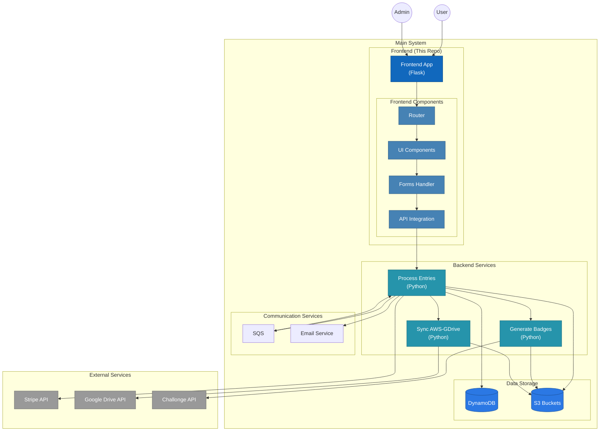

# TKD Registration - Frontend

This repo holds the code for the Frontend of the "TKD Registration Project".

## Overall Architecture

## Dependencies
- Setup Stripe Account
- Deploy base infrastructure using the [tkd-registration](https://github.com/audioboxer217/terraform-kseppler-tkd-registration) Terraform Module. This must be done **first**.
- Deploy the [Backend](https://github.com/audioboxer217/tkd-registration-backend). This can be done before or after.
- Python 3.11
- Optional but recommended: Use a Virtual Env
  - example: 
    > `python -m venv --upgrade-deps .venv`
    >
    > `source .venv/bin/activate`
- Install required packages: `pip install -r requirements.txt`

## Local Development
1. Create a 'frontend.env' file with the necessary environment variables
    - AWS_DEFAULT_REGION - Default AWS region
    - AWS_PROFILE - AWS Profile to use from your local .aws/config file
    - COMPETITION_NAME - Name to use for the competition
    - COMPETITION_YEAR - Year of the competition
    - EARLY_REG_DATE - When the 'Early Regestration' discount ends (11:59:59 PM on this date)
    - REG_CLOSE_DATE - When to close registstrations (11:59:59 PM on this date)
    - CONFIG_BUCKET - S3 Bucket name that contains the config files (generated by Terraform)
    - CONTACT_EMAIL - Email to use as a Contact
    - DB_TABLE - DynamoDB Table generated by Terraform
    - MAPS_API_KEY - API Key for Google Maps API (details [here](https://developers.google.com/maps/documentation/embed/get-api-key))
    - PROFILE_PIC_BUCKET - S3 Bucket name for holding profile pics (generated by Terraform)
    - PUBLIC_MEDIA_BUCKET - S3 Bucket name for holding public media (generated by Terraform)
    - REG_URL - URL for the Registration Site
    - SQS_QUEUE_URL - SQS Queue URL for 'processing' (generated by Terraform)
    - STRIPE_API_KEY - API Key for accessing Stripe (located [here](https://dashboard.stripe.com/apikeys))
    - VISITOR_INFO_URL - URL to use for the 'visitor info' button (suggested: Official travel site for CITY)
    - VISITOR_INFO_TEXT - Text to use for the 'visitor info' button (suggested: "Things to do in CITY")
2. Run Local Server
    - If using VSCode, there is a `launch.json` file already in place so you can use the debugger
    - Otherwise, you can run: 
      > `set -a && source frontend.env && set +a`
      > 
      > `flask --app app --debug run`

## Deploying
This project uses [Zappa](https://github.com/Zappa/Zappa) for deployments.
1. Ensure there is a yml file in the [envs](./envs/) folder for the environment you want to deploy
    - If there isn't one, you can use an existing yaml file as a template to create a new one.
2. If you are using a Python Virtual Env (recommended), be sure it's activated
3. Run `zappa deploy <env_name> -s envs/<env_file_name>.yml`
4. Confirm site is running well.
5. Optional, if using a custom domain, ensure the Cert is ready then run `zappa certify <env> -s envs/<env_file_name>.yml`

Subsequent updates to the site can be made with `zappa update <env_name> -s envs/<env_file_name>.yml`