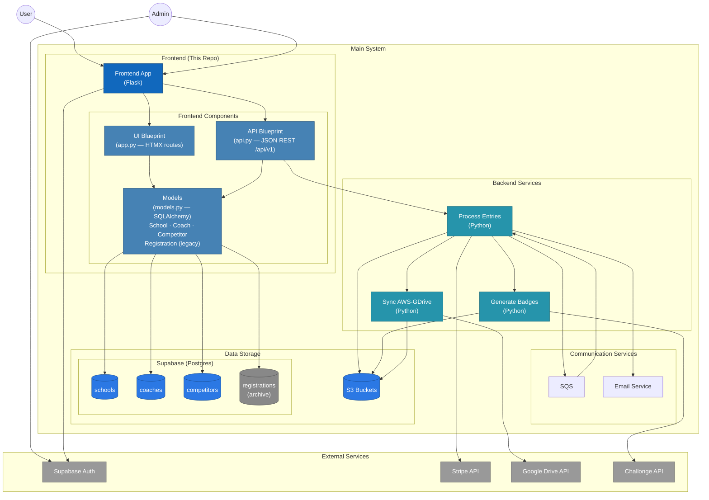

# TKD Registration - Frontend

This repo holds the code for the Frontend of the "TKD Registration Project".

## Overall Architecture

```mermaid
graph TB
    User((User))
    Admin((Admin))

    subgraph "Main System"
        subgraph "Frontend (This Repo)"
            FrontendApp["Frontend App<br/>(Flask)"]

            subgraph "Frontend Components"
                UIBlueprint["UI Blueprint<br/>(app.py — HTMX routes)"]
                APIBlueprint["API Blueprint<br/>(api.py — JSON REST /api/v1)"]
                Models["Models<br/>(models.py — SQLAlchemy)<br/>School · Coach · Competitor<br/>Registration (legacy)"]
            end
        end

        subgraph "Backend Services"
            ProcessEntries["Process Entries<br/>(Python)"]
            GenerateBadges["Generate Badges<br/>(Python)"]
            SyncAWSGDrive["Sync AWS-GDrive<br/>(Python)"]
        end

        subgraph "Data Storage"
            subgraph Supabase["Supabase (Postgres)"]
                SchoolsTable[("schools")]
                CoachesTable[("coaches")]
                CompetitorsTable[("competitors")]
                RegistrationsTable[("registrations<br/>(archive)")]
            end
            S3[("S3 Buckets")]
        end

        subgraph "Communication Services"
            SQS["SQS"]
            EmailService["Email Service"]
        end
    end

    User --> FrontendApp
    Admin --> FrontendApp

    FrontendApp --> UIBlueprint
    FrontendApp --> APIBlueprint
    UIBlueprint --> Models
    APIBlueprint --> Models
    Models --> SchoolsTable
    Models --> CoachesTable
    Models --> CompetitorsTable
    Models --> RegistrationsTable

    APIBlueprint --> ProcessEntries
    ProcessEntries --> GenerateBadges
    ProcessEntries --> SyncAWSGDrive

    ProcessEntries --> S3
    GenerateBadges --> S3
    SyncAWSGDrive --> S3

    ProcessEntries --> SQS
    SQS --> ProcessEntries
    ProcessEntries --> EmailService

    Admin --> SupabaseAuth
    FrontendApp --> SupabaseAuth

    ProcessEntries --> Stripe
    SyncAWSGDrive --> GoogleDrive
    GenerateBadges --> Challonge

    EmailService ~~~ Stripe
    EmailService ~~~ GoogleDrive
    EmailService ~~~ Challonge
    S3 ~~~ SupabaseAuth

    subgraph "External Services"
        Stripe["Stripe API"]
        GoogleDrive["Google Drive API"]
        Challonge["Challonge API"]
        SupabaseAuth["Supabase Auth"]
    end

    classDef frontend fill:#1168bd,stroke:#0b4884,color:#ffffff
    classDef frontendComponent fill:#4682b4,stroke:#315b7e,color:#ffffff
    classDef backend fill:#2694ab,stroke:#1a6d7d,color:#ffffff
    classDef database fill:#2b78e4,stroke:#1a4d91,color:#ffffff
    classDef legacy fill:#888888,stroke:#555555,color:#ffffff
    classDef external fill:#999999,stroke:#666666,color:#ffffff

    class FrontendApp frontend
    class UIBlueprint,APIBlueprint,Models frontendComponent
    class ProcessEntries,GenerateBadges,SyncAWSGDrive backend
    class SchoolsTable,CoachesTable,CompetitorsTable,S3 database
    class RegistrationsTable legacy
    class Stripe,GoogleDrive,Challonge,SupabaseAuth external
```

## Dependencies
- Setup Stripe Account
- Create a [Supabase](https://supabase.com) project (for Postgres DB and Auth)
- Deploy base infrastructure using the [tkd-registration](https://github.com/audioboxer217/terraform-kseppler-tkd-registration) Terraform Module. This must be done **first**.
- Deploy the [Backend](https://github.com/audioboxer217/tkd-registration-backend). This can be done before or after.
- Python 3.11+
- [uv](https://github.com/astral-sh/uv) package manager

## Project Structure

```
app.py        # UI Blueprint — all page and HTMX partial routes (Flask)
api.py        # API Blueprint — JSON REST endpoints at /api/v1
models.py     # SQLAlchemy models (School, Coach, Competitor, Registration [legacy])
templates/    # Jinja2 HTML templates
static/       # Static assets (CSS, images, etc.)
tests/        # pytest test suite
envs/         # Zappa deployment config YAML files (one per environment)
pyproject.toml
```

## Local Development
1. Install `uv` and sync dependencies:
    ```bash
    curl -LsSf https://astral.sh/uv/install.sh | sh
    uv sync --all-extras --dev
    ```

2. Create a `frontend.env` file with the necessary environment variables (see table below).

3. Initialize the database (first time only):
    ```bash
    set -a && source frontend.env && set +a
    uv run python scripts/init_db.py
    ```
    If you need to recreate the local database from scratch, use:
    ```bash
    set -a && source frontend.env && set +a
    uv run python scripts/reset_db.py
    ```

4. Run the local development server:
    ```bash
    set -a && source frontend.env && set +a
    flask --app app --debug run
    ```
    Or use the VSCode debugger via the existing `launch.json`.

### Environment Variables

| Variable | Required | Description |
|---|---|---|
| `DATABASE_URL` | Yes | Supabase Postgres connection string (`postgresql+psycopg://...`) |
| `SUPABASE_URL` | Yes | Supabase project URL (e.g. `https://xxxx.supabase.co`) |
| `SUPABASE_ANON_KEY` | Yes | Supabase `anon` public key |
| `SUPABASE_SERVICE_ROLE_KEY` | Yes | Supabase service role key (for admin operations) |
| `SUPABASE_JWT_SECRET` | Yes | Supabase JWT secret (for verifying API tokens) |
| `FLASK_SECRET_KEY` | Yes | Random secret for Flask session signing |
| `COMPETITION_NAME` | Yes | Name to use for the competition |
| `COMPETITION_YEAR` | No | Year of the competition |
| `CONTACT_EMAIL` | Yes | Contact email shown to registrants |
| `EARLY_REG_DATE` | Yes | When the early registration discount ends (e.g. `June 01, 2026`) |
| `REG_CLOSE_DATE` | Yes | When to close registrations (e.g. `July 01, 2026`) |
| `CONFIG_BUCKET` | Yes | S3 bucket containing config files (schools.json, weight_classes.json, etc.) |
| `PUBLIC_MEDIA_BUCKET` | Yes | S3 bucket for public media (schedule, booklet) |
| `PROFILE_PIC_BUCKET` | No | S3 bucket for profile pictures |
| `SQS_QUEUE_URL` | Yes | SQS queue URL for processing notifications |
| `STRIPE_API_KEY` | Yes | Stripe secret API key |
| `REG_URL` | Yes | Public URL of the deployed app |
| `AWS_REGION` | No | AWS region for S3/SQS (default: `us-east-1`) |
| `AWS_DEFAULT_REGION` | No | Alternative AWS region env var |
| `AWS_PROFILE` | No | AWS profile from `~/.aws/config` for local dev |
| `LOCAL_TIMEZONE` | No | Timezone for date display (default: `US/Central`) |
| `MAPS_API_KEY` | No | Google Maps API key (required if `ENABLE_ADDRESS=true`) |
| `ENABLE_ADDRESS` | No | Set to `true` to show address field on registration form |
| `ENABLE_BADGES` | No | Set to `true` to enable badge generation feature |
| `BUTTON_STYLE` | No | Bootstrap button class (default: `btn-primary`) |
| `EVENT_CITY` | No | City name shown on event info page |
| `VISITOR_INFO_URL` | No | URL for the visitor info button |
| `VISITOR_INFO_TEXT` | No | Label for the visitor info button |
| `CONNECT_ACCT` | No | Stripe Connect account ID (for split payments) |

### Creating an Admin User

Admin users are managed in Supabase. After creating a user via the Supabase dashboard, set their `app_metadata` using the Supabase admin API:

```bash
curl -X PUT 'https://<your-project>.supabase.co/auth/v1/admin/users/<user-uuid>' \
  -H "Authorization: Bearer <service_role_key>" \
  -H "Content-Type: application/json" \
  -d '{"app_metadata": {"role": "admin"}}'
```

## Deploying
This project uses [Zappa](https://github.com/Zappa/Zappa) for deployments to AWS Lambda.

Each environment has a YAML file in the [envs](./envs/) folder. Environment variables are loaded at runtime from a JSON file stored in S3 (configured via `remote_env` in the YAML).

1. Ensure a yml file exists in [envs](./envs/) for your target environment.
2. Activate your virtual environment (`.venv`) or rely on `uv run`.
3. First-time deploy:
    ```bash
    uv run zappa deploy <env_name> -s envs/<env_file>.yml
    ```
4. Subsequent updates:
    ```bash
    uv run zappa update <env_name> -s envs/<env_file>.yml
    ```
5. Optional — set up a custom domain TLS cert:
    ```bash
    uv run zappa certify <env_name> -s envs/<env_file>.yml
    ```

### Updating the remote_env S3 JSON

The S3 env JSON must include all required variables from the table above. At minimum, ensure the following are set:

```json
{
  "DATABASE_URL": "postgresql+psycopg://...",
  "SUPABASE_URL": "https://xxxx.supabase.co",
  "SUPABASE_ANON_KEY": "...",
  "SUPABASE_SERVICE_ROLE_KEY": "...",
  "SUPABASE_JWT_SECRET": "...",
  "FLASK_SECRET_KEY": "..."
}
```

### Database Migrations

Run Flask-Migrate against your Supabase Postgres instance:

```bash
# First time only — generates the migrations/ directory
uv run flask --app app db init

# Generate the initial schema migration
uv run flask --app app db migrate -m "initial schema"

# Apply to Supabase
uv run flask --app app db upgrade
```

Subsequent schema changes: run `flask db migrate` + `flask db upgrade` after changing `models.py`.